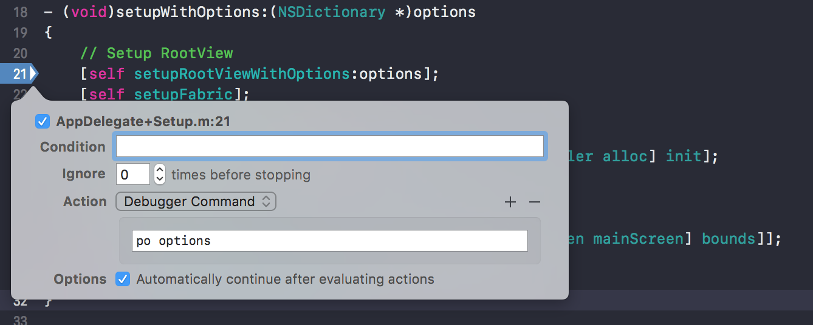

# React Native vs Native iOS

- Jelle Vandebeeck 🐦 [@fousa](https://twitter.com/fousa)
- Dylan Gyesbreghs 🐦 [@dylangyesbreghs](https://twitter.com/dylangyesbreghs)
- Hannes Van den Berghe 🐦 [@VDBHannes](https://twitter.com/VDBHannes)

---

# Provisioning Profiles 💩

---

## Why do we need this?

- Debug our application on our device
- Distribute builds through HockeyApp or TestFlight.
- Submit builds to the App Store.

---

## Why is a certificate used?

- Identify the developer
- Make sure that you are authorized to create an application.

---

## Signing

What is signing?

---

## Signing

Signing your app allows iOS to identify who signed your app and to verify that your app hasn’t been modified since you signed it.

---

## What is a provisioning profile?

- Allows us to distribute applications
- Identifies the devices that are allowed to run the build

---

## Types of provisioning profiles

- Development
- Ad Hoc
- In House
- App Store

---

### Development

- Debug on your device
- Debug mode enabled
- Devices should be registered

---

### Ad Hoc

- Can be used for In App Purchase testing
- Has a limited registered devices

---

### In House

- Unlimited devices
- Only with the enterprise program
- Should be trusted on device

---

### App Store

- TestFlight
- Only with the developer program

---

## Provisioning profiles can become invalid

- After one year
- When the app id is deleted
- When the certificate is revoked

---

## Where do we find what?

- Developer Portal
- iTunes Connect

---

### Developer Portal

- Register your app
- Register your devices
- Request the certificates
- Create the provisioning profiles

---

### iTunes Connect

- Register the app for App Store/TestFlight upload.
- Prepare new versions of the app.
- Upload the app meta data for the App Store

---

## Identifiers

- Wildcard bundle identifier
- Explicit bundle identifier

---

### Wildcard Identifiers

- Push notifications not available

---

## IAP

- Only with Ad Hoc provisioning profiles

---

## Configuring your provisioning profiles

- Creating a new certificate with Keychain
- Create an application on the Developer Portal
- Add a device to the developer portal
- Create a development provisioning profile
- Create a distribution provisioning profile

---

## Keychain

- Lookup the distribution certificate
- Move the private key around

---

## Xcode

- Configure your project with configuration files

---

## Jenkins

- Open the provisioning profile on Jenkins
- Certificates should be available

---

# Thank you! 🤘

---

---

# Xcode

---

## Our beloved editor

- Xcode 9.2 since yesterday
- Possibility to use multiple versions


---

## What's in it

---

### General


---

### Capabilities


---

### Resource tags


---

### Resource tags


---

### Info


---

### Build Settings


---

### Build Phases


---

### Build Phases


---

### Build Rules


---

### Build Rules


---

### Project Info


---

#### Project: Build Settings


---

### Project Build structure

- Synx: https://github.com/venmo/synx
- Not `100%` strict


---


# External frameworks

---

## Pods

- Cocoapods: https://cocoapods.org

---

### Pods setup

* `sudo gem install cocoapods`
* `pod init`
* `pod install`
* `pod update`


* Open `.xcworkspace`


---

### Pod Example

```ruby
platform :ios, '10.0'
target 'Sinterklaas' do
  use_frameworks!
  # Setup Crashreporting
  pod 'Fabric'
  pod 'Crashlytics'
  # Setup React Native through Cocoapods
  pod 'React', :path => '../node_modules/react-native', :subspecs => [
    'Core',
    'BatchedBridge',
    'DevSupport',
    'RCTText',
    'RCTNetwork',
    'RCTWebSocket'
  ]
  # Explicitly include Yoga if you are using RN >= 0.42.0
  pod 'yoga', :path => '../node_modules/react-native/ReactCommon/yoga'
  # Third party deps podspec link
  pod 'DoubleConversion', :podspec => '../node_modules/react-native/third-party-podspecs/DoubleConversion.podspec'
  pod 'GLog', :podspec => '../node_modules/react-native/third-party-podspecs/GLog.podspec'
  pod 'Folly', :podspec => '../node_modules/react-native/third-party-podspecs/Folly.podspec'
end
```

---

### Pod Example

```ruby
pod `JTSImageViewController`, '~> 1.5'
pod 'JTSImageViewController', '1.5.1'
```

---

## Embed Frameworks


---

## Embed Frameworks


---

## Search paths


---

# Configuration

* Develop / Debug / Development
* Beta
* Release / Production
* Shared

---

## Configuration React

* Debug
* Release
* Shared

---

## `Prepare_xcconfig.rb`

```ruby
module Fastlane
  module Actions
    class PrepareXcconfigAction < Action
      def self.run(params)
        # fastlane will take care of reading in the parameter and fetching the environment variable:
        UI.message "Update Xcconfig"
        scheme_name = params[:scheme_name]
        command = [
          'cp',
          "Configuration/#{scheme_name}.xcconfig",
          'Configuration/Release.xcconfig',
        ].join(' ')

        Actions.sh command
      end

      #####################################################
      # @!group Documentation
      #####################################################

      def self.description
        'Prepare Xconfig.'
      end

      def self.details
        'Prepare Xconfig.'
      end

      def self.available_options
        [
          FastlaneCore::ConfigItem.new(
            key: :scheme_name,
            env_name: 'FL_PREPARE_XCCONFIG_SCHEME_NAME',
            description: 'Define the scheme name',
            is_string: true,
            optional: true,
            default_value: 'Alpha'
          )
        ]
      end

      def self.output
        []
      end

      def self.return_value
      end

      def self.authors
        ["dgyesbreghs"]
      end

      def self.is_supported?(platform)
        platform == :ios
      end
    end
  end
end
```

---

## Configuration files

---

#### `Shared.xcconfig`

```ruby
PRODUCT_NAME = Sinterklaas
PRODUCT_BUNDLE_IDENTIFIER = com.icapps.sinterklaas

CODE_SIGN_STYLE = Manual
DEVELOPMENT_TEAM = FAJTRUZ6J9
```

---

#### `Debug.xcconfig`

```ruby
#include "Shared.xcconfig"

CODE_SIGN_IDENTITY = iPhone Developer
PROVISIONING_PROFILE_SPECIFIER = Sinterklaas Debug
```

---

#### `Release.xcconfig`
```ruby
#include "Shared.xcconfig"

CODE_SIGN_IDENTITY = iPhone Distribution
PROVISIONING_PROFILE_SPECIFIER = Sinterklaas Release
```

---


---

# `project.pbxproj`

---

# App Icons and Launch Images

---

## Launch images


---

## Launch screen


---

## App Icon


---

# Apple developer guidelines

- https://developer.apple.com/ios/human-interface-guidelines/overview/themes/

---
# Debugging in xcode

---

## Breakpoint actions



More information:
 https://www.bignerdranch.com/blog/xcode-breakpoint-wizardry/

---

## Exception breakpoints


---

## tools


---

# Part 3

* Fastlane
* Demo
* Questions?

---

## Fastlane 🚀

`fastlane` is a tool for iOS and Android developers to automate tedious tasks like generating screenshots, dealing with provisioning profiles, and releasing your application.

---

## Fastlane 🚀

* `fastlane`
	* `Fastfile`
	* `Pluginfile`
	* `actions`
		* `npm_install.rb`
		* `prepare_xcconfig.rb`

^
Structure of fastlane inside a iOS/Android project
* npm_install: make sure all the node modules are in place
* prepapre_xcconfig: because that's why

---

## Fastlane 🚀

* `gym` or `build_ios_app`
* `pilot` or `upload_to_testflight`
* `hockey`
* `custom actions`
	* `update_translations`
	* `install_provisioning_profiles`

^
* update_translations: Update translations from the iCapps translations tool
* install_provisioning_profiles: Locate *.mobileprovisioning inside you're repo

---

## Fastlane 🚀

* Local actions (actions folder)
* Submit action to fastlane main repo
* Publishing your plugin

^
* Local actions: Actions folder
* Submit action: Through Github (Pull Request)
* Publish your plugin: Through RubyGem (NPM/Cocoapods for Ruby)

---

## Demo

---

## Questions?

---

## Links

[https://fabric.io/](https://fabric.io/)
[https://cocoapods.org/](https://cocoapods.org/)
[https://appcenter.ms/](https://appcenter.ms/)
[https://fastlane.tools/](https://fastlane.tools/)
[https://github.com/icapps/fastlane-configuration](https://github.com/icapps/fastlane-configuration)
[https://github.com/dgyesbreghs/install-provisioning-profiles](https://github.com/dgyesbreghs/install_provisioning_profiles)
